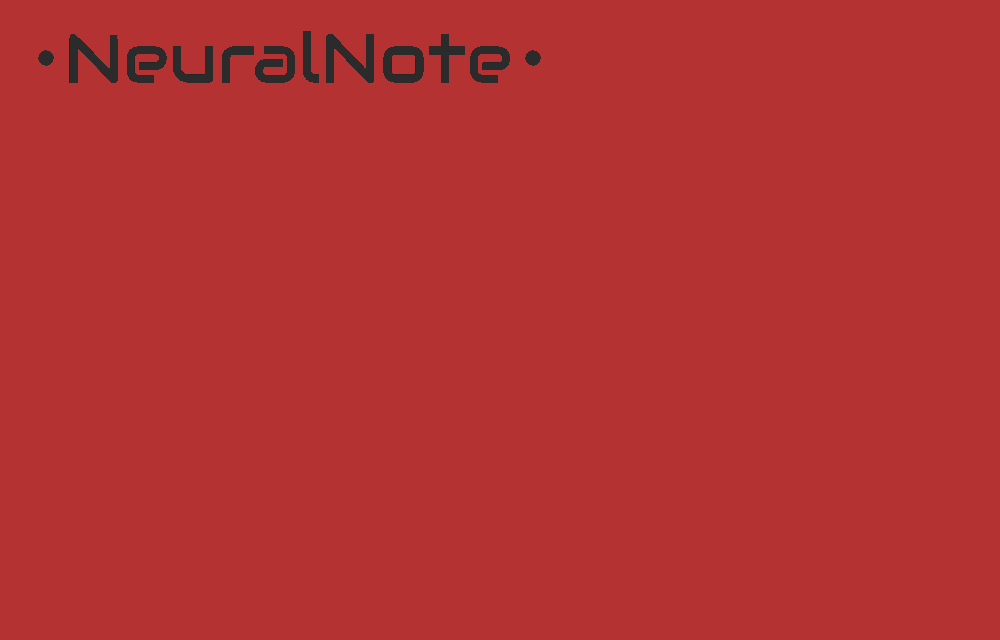
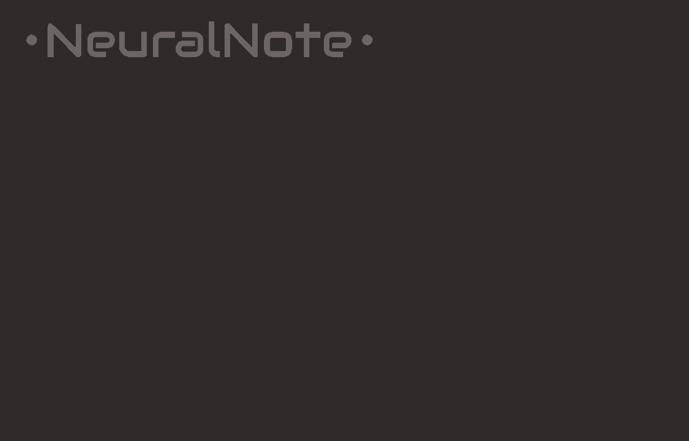

**NeuralNote** but with nicer backgrounds and the ability to swap background

Red 
Black 

## To do list

1) Make backgrounds
2) Make a dictionary with better names attached to the .png
3) Have the ability to swap backgrounds in settings
4) Update documentation
5) Retain background after update

## Credits

NeuralNote was developed by [Damien Ronssin](https://github.com/DamRsn) and [Tibor Vass](https://github.com/tiborvass).
The plugin user interface was designed by Perrine Morel.

#### Contributors

Many thanks to the contributors!

- [jatinchowdhury18](https://github.com/jatinchowdhury18): File browser.
- [trirpi](https://github.com/trirpi)
- [polygon](https://github.com/polygon) and [SamuMazzi](https://github.com/SamuMazzi): Linux support.
